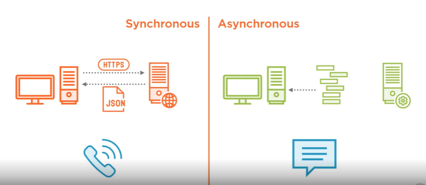
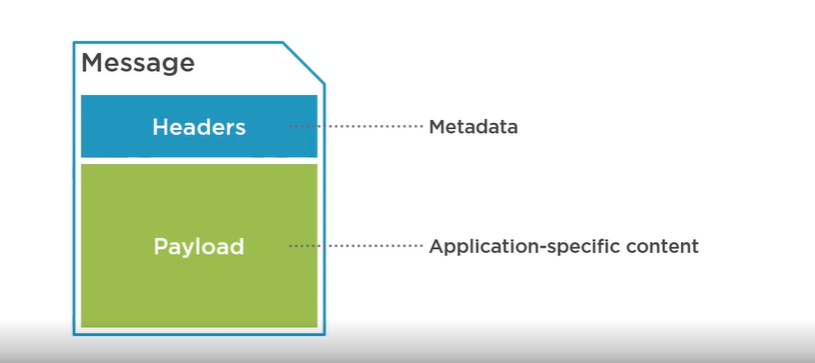

# Full Stack Development

### Spring Integration

- Integrate many different kings of systems without writing plumbing code
- Seperate integration code from business logic
- Use Enterprise Integration Patterms in your Spring-Based applications

#### Setting the scene

- Enterprise Integration Patterns
- Asynchronous messaging
- Spring integration

#### Design Patterns

- Common reusable solutions
- Enterprise Integration Patterns: Designing, building, and deploying messaging solutions

#### Understanding [EIP](https://www.enterpriseintegrationpatterns.com)

- Synchronous vs Asynchronous, 

#### Asynchronous Advantages

- More responsive system because sender does not have to wait.
- Message buffering makes the system resilient to failure.
- Receiver processes messages at its own rate.

#### EIP Patterns

- Asynchronous messaging
- Message: It consist of headers and payload
- Headers: Metadata
- Payload: Application specific content, 

